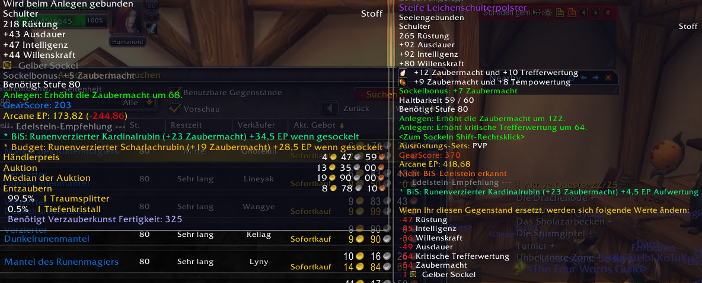

# WOTLK Pawn

A World of Warcraft addon for **Wrath of the Lich King Classic (3.3.5a)** that calculates Equivalent Points (EP) for gear and displays the result directly in item tooltips. Developed from scratch heavily influenced by Pawn.

## Features

- **EP scoring in tooltips** — hover any equippable item to see its EP value and a green/red delta vs your currently equipped gear
- **Class/spec/level aware** — automatically detects your class, talent specialization, and level to apply the correct stat weights
- **Leveling & endgame weights** — separate weight tables for levels 1–79 and level 80, with automatic switching
- **Hard cap enforcement** — hit and expertise rating contribute zero EP once you reach the configured cap
- **Soft cap system** — configurable per-stat soft caps with custom multipliers via a modal Soft Cap Manager
- **Enchant scoring** — item EP includes enchantment stats (68 WotLK permanent enchants supported)
- **Gem scoring** — item EP includes socketed gem stats (156 WotLK gems in the lookup table)
- **Gem recommendations** — BiS and budget gem suggestions in tooltips with EP delta vs your current gems
- **Non-BiS gem warnings** — orange warning when a suboptimal gem is detected in an item
- **Manual weight overrides** — edit any stat weight or cap value via the config panel; changes persist across sessions
- **Spec/bracket forcing** — override auto-detection to lock a specific specialization or weight bracket
- **Localization** — full English (enUS) and German (deDE) support for UI, stat labels, and gem names

## Supported Classes & Specs

All 10 WotLK classes with all 30 talent specializations are supported, each with tailored stat weights for both leveling and endgame.

## Installation

1. Download or clone this repository
2. Copy all files from `src/main/lua/` into your WoW AddOns folder:
   ```
   World of Warcraft/Interface/AddOns/WOTLKPawn/
   ```
   The folder should contain:
   - `wotlk-pawn.toc`
   - `wotlk-pawn.lua`
   - `wotlk-pawn.persistence.lua`
   - `wotlk-pawn.core.lua`
   - `wotlk-pawn.frontend.lua`
3. Launch WoW

## Usage

### Tooltips
Simply hover over any equippable item. The addon appends:
- **EP value** with your current spec name (e.g., `Arcane EP: 125.40`)
- **Delta** vs equipped gear in green (upgrade) or red (downgrade)
- **Gem recommendations** for items with empty sockets or non-BiS gems



### Configuration
Open the config panel via:
- `/pawn-config` in chat, or
- **Interface → AddOns → WOTLK Pawn**

From there you can:
- Edit stat weights for your current class/spec/bracket
- Set hit and expertise hard caps
- Manage soft caps (per-stat thresholds with custom multipliers)
- Force a specific specialization or weight bracket

### Slash Commands
| Command | Description |
|---------|-------------|
| `/pawn-config` | Open the configuration panel |
| `/pawn-dumpdb` | Print current overrides from SavedVariables for debugging |


